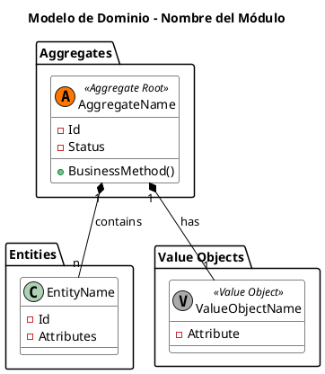

# Plantilla: Diagrama de Modelo de Dominio

## Modelo Táctico

## Explicación del Modelo

Detallar las invariantes principales y las relaciones clave entre los objetos del dominio.

[back](../diagram-conventions.md)
