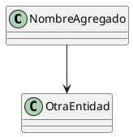

# Modelo de Dominio: [Nombre del Bounded Context]

**Bounded Context:** [Nombre]  
**Responsabilidad Principal:** [Una frase clara]  
**Version:** 1.0.0

## Lenguaje ubicuo

| Termino | Definicion                          | Ejemplo                   |
|---------|-------------------------------------|---------------------------|
|Employee | Persona con relacion laboral formal | Juan Perez (Legajo 45823) |
|Contract | Acuerdo laboral vigente o historico | Contrato indefinido       |

## Diseno tactico

### Aggregate roots

- **`NombreAgregado`**: descripcion breve y principales invariantes que protege.

### Entidades

- **`OtraEntidad`**: entidad interna o relacionada con el aggregate root.

### Value objects

- **`EmailAddress`**: validaciones y comportamiento.
- **`DateRange`**: evita rangos invalidos.

### Domain events

- `UserCreated`: descripcion del evento y consumidores conocidos.

## Reglas de negocio

1. [Invariante principal del agregado].
2. [Restriccion de unicidad o consistencia].
3. [Regla temporal, jerarquica o contractual].

## Notas de modelado

- Define claramente que conceptos pertenecen a este bounded context y cuales no.
- Explica cualquier referencia a otros modulos sin romper la autonomia del dominio.
- Si hay decisiones delicadas, enlaza al ADR correspondiente.

## Diagramas

Incluye solo diagramas que ayuden a entender el modelo. Si no aportan claridad, es mejor omitirlos.

Ejemplo opcional:

[back](./readme.md)
