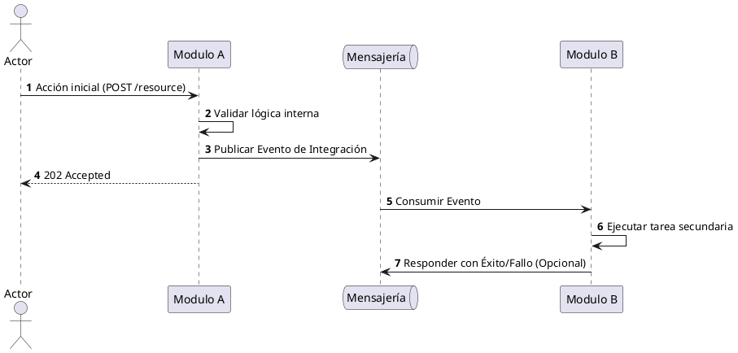

# Plantilla: Diagrama de Secuencia

## Flujo: [Nombre del Proceso]

## Descripción del Escenario

Explicar brevemente qué sucede en este flujo y por qué es importante para el sistema.

[back](../diagram-conventions.md)
