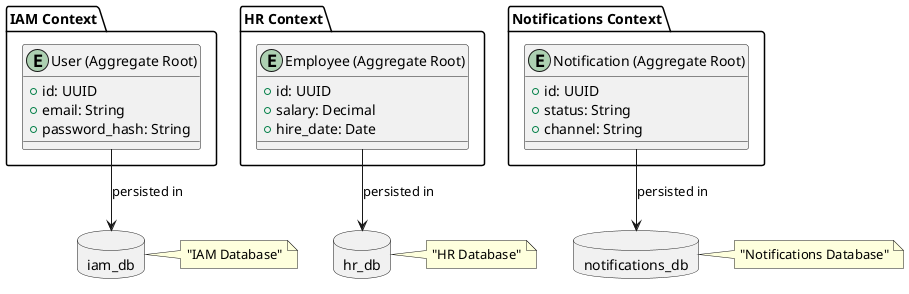

# Data Sovereignty: Database per Bounded Context

- Status: accepted
- Date: 2026-04-04
- Deciders: Arquitecto de Software
- Tags: architecture, persistence, data-sovereignty

## Context and Problem Statement

En el desarrollo del sistema ERP, se ha identificado la necesidad de implementar una arquitectura que garantice la soberanía de los datos. Si varios Bounded Contexts comparten una sola base de datos, se originan problemas como:

- **Conflictos de modelo:** Diferentes Bounded Contexts requieren esquemas y reglas de datos incompatibles.
- **Escalabilidad limitada:** El crecimiento del sistema se ve restringido por la dependencia de una única base de datos centralizada.
- **Riesgos de exposición:** Un fallo o brecha en una parte del sistema puede comprometer todos los datos.

Una sola base de datos compartida no puede satisfacer las necesidades específicas y seguras de cada Bounded Context, especialmente cuando se requiere escalabilidad horizontal y autonomía operativa.

## Decision Drivers

- Autonomía de cada Bounded Context para evolucionar su modelo de datos.
- Seguridad y aislamiento de datos sensibles entre módulos.
- Escalabilidad independiente por módulo.
- Coherencia con los principios de DDD y Clean Architecture del proyecto.

## Considered Options

- **Shared Database:** Base de datos compartida entre todos los contextos.
- **Federated Database:** Esquema central con tablas específicas por contexto.
- **Database per Bounded Context:** Base de datos independiente por cada contexto.

## Decision Outcome

Chosen option: "Database per Bounded Context", porque garantiza aislamiento, escalabilidad independiente y coherencia con la arquitectura modular del ERP.

### Decisiones técnicas

1. **Base de datos por Bounded Context:**
   - Cada Bounded Context tendrá una base de datos independiente.
   - Ejemplo: `iam_db`, `hr_db`, `notifications_db`.

2. **Repositorios y acceso:**
   - Los repositorios de cada Bounded Context solo trabajarán con su propia base de datos.
   - No deben existir dependencias transversales a nivel de repositorio.

3. **Consistencia y sincronización:**
   - La sincronización entre Bounded Contexts se gestionará a través de eventos de integración.
   - Se evita la necesidad de transacciones distribuidas complejas.

### Positive Consequences

- **Escalabilidad:** Cada Bounded Context puede escalar independientemente según sus requisitos.
- **Soberanía de datos:** Los datos de un contexto no están expuestos a las vulnerabilidades de otros contextos.
- **Flexibilidad:** Cada equipo puede evolucionar su modelo de datos sin afectar a otros módulos.
- **Seguridad:** Limita la exposición de datos sensibles al perímetro de cada contexto.

### Negative Consequences

- **Complejidad operativa:** La gestión de múltiples bases de datos aumenta la complejidad en tareas como backups, monitoring y migraciones.
- **Overhead de configuración:** Cada Bounded Context requerirá su propia configuración de conexión y manejo de errores.
- **Costo de infraestructura:** El costo de recursos de bases de datos aumentará con cada nuevo contexto.

## Pros and Cons of the Options

### Shared Database

- Good, because es más sencillo de implementar al inicio.
- Good, because permite JOINs directos entre contextos.
- Bad, because complica la escalabilidad a largo plazo.
- Bad, because introduce dependencias inadecuadas entre contextos.
- Bad, because un fallo compromete todos los datos.

### Federated Database

- Good, because ofrece cierta separación lógica.
- Bad, because no permite escalado independiente de infraestructura.
- Bad, because complica las consultas con JOINs entre esquemas.
- Bad, because mantiene acoplamiento a nivel de motor de base de datos.

## Diagrama de Arquitectura

## Links

- Relates to [Separación de Identidad y Empleado](20260404-separacion-de-identidad-y-empleado.md)
- Relates to [Infrastructure](../infrastructure.md)
