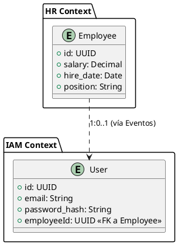

# Separación de Identidad (User) y Dominio Laboral (Employee)

- Status: accepted
- Date: 2026-04-09
- Deciders: Arquitecto de Software
- Tags: architecture, identity, bounded-contexts

## Context and Problem Statement

En el desarrollo del ERP, existe una confusión común entre la persona como "sujeto que accede al sistema" y la persona como "recurso laboral de la empresa".

Si unificamos ambas entidades en una sola tabla/modelo:

- El módulo de Identidad (IAM) se acopla a la lógica de negocio de RRHH (nóminas, departamentos).
- Es difícil gestionar usuarios que no son empleados (auditores, bots) o empleados que no tienen acceso al sistema.
- La seguridad se ve comprometida al mezclar credenciales de acceso con datos sensibles de contratos en la misma base de datos.

## Decision Drivers

- Seguridad: aislar credenciales de datos laborales.
- Flexibilidad: soportar usuarios no empleados y empleados sin cuenta.
- Escalabilidad: permitir que IAM y HR escalen independientemente.
- Coherencia con el principio de Database per Bounded Context.

## Considered Options

- **Entidad Única (Monolítica):** Fácil de implementar al inicio (JOINs simples), pero difícil de escalar y mantener a largo plazo.
- **Separación Lógica (Shared Database):** Usar esquemas diferentes en la misma DB. Es un paso intermedio válido, pero no permite escalado independiente de infraestructura.
- **Separación completa en dos Bounded Contexts:** Cada contexto con su modelo, persistencia y responsabilidad.

## Decision Outcome

Chosen option: "Separación completa en dos Bounded Contexts", porque ofrece el mejor balance entre seguridad, flexibilidad y escalabilidad.

### Definición de Identidad (Contexto IAM)

- Entidad: `User`
- Persistencia: Base de datos `iam_db`.
- Responsabilidad: Autenticación, Roles (RBAC), Tokens JWT y MFA.
- Referencia: Contendrá un campo `EmployeeId` que apunta al identificador del empleado en HR (si aplica).

### Definición de Dominio Laboral (Contexto HR)

- Entidad: `Employee`
- Persistencia: Base de datos `hr_db`.
- Responsabilidad: Ciclo de vida laboral (contratos, salarios, vacaciones).
- Referencia: No conoce la existencia de contraseñas ni roles de sistema.

### Mecanismo de Sincronización

La comunicación se realizará mediante Eventos de Integración (Coreografía):

- Cuando RRHH crea un Employee, publica `EmployeeHiredIntegrationEvent`.
- El servicio IAM escucha ese evento y crea un `User` con permisos por defecto.

### Positive Consequences

- **Seguridad (Isolation):** Las brechas de seguridad en el perfil del usuario no exponen datos de nómina.
- **Escalabilidad:** El servicio IAM puede recibir 10,000 peticiones de validación de token sin afectar el rendimiento del módulo de RRHH.
- **Flexibilidad:** Permite que una persona tenga múltiples cuentas de usuario o que un usuario represente a una entidad no humana.

### Negative Consequences

- **Complejidad de datos:** No se pueden hacer JOINs SQL entre Usuario y Empleado. La agregación de datos debe hacerse en el API Gateway o mediante proyecciones (CQRS).
- **Consistencia eventual:** Hay un pequeño desfase de milisegundos desde que se crea el empleado hasta que el usuario es habilitado. La composición de datos cruzados se realizará en el API Gateway o en el Frontend.

## Links

- Relates to [Data Sovereignty ADR](20260404-data-sovereignty-database-per-bounded-context.md)
