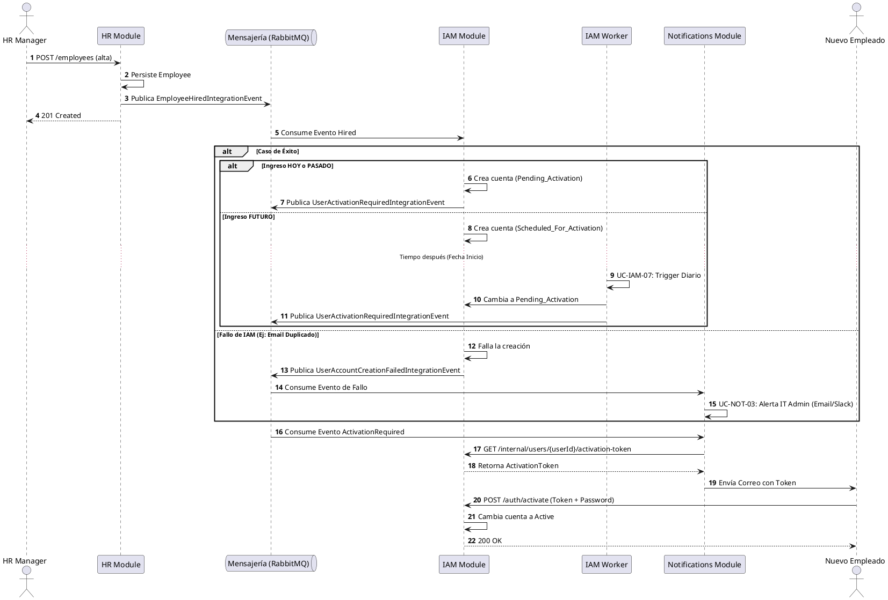

# Proceso Global 01: Employee Onboarding

## Objetivo

Describir el flujo end-to-end desde la contratacion administrativa de un empleado hasta la activacion efectiva de su acceso al ERP.

## Modulos participantes

- **Human Resources (HR):** fuente de verdad del alta laboral.
- **Identity & Access (IAM):** gestiona identidad tecnica, credenciales y activacion.
- **Notifications:** envia comunicaciones necesarias para completar el proceso.

## Flujo principal

### 1. Alta administrativa

- **Actor:** gestor de Recursos Humanos
- **Modulo:** `human-resources`
- **Caso de uso relacionado:** `UC-HR-01: Contratar Empleado`

HR registra los datos personales, contractuales y organizacionales del empleado. Una vez confirmada el alta, publica el evento `EmployeeHiredIntegrationEvent`.

### 2. Aprovisionamiento de identidad

- **Actor:** sistema
- **Modulo:** `identity-and-access`
- **Casos de uso relacionados:**
  - `UC-IAM-01: Provision User`
  - `UC-IAM-07: Process Scheduled Activations`

IAM consume el evento de HR y crea la identidad del usuario. Si la fecha de inicio del contrato es futura, la cuenta nace en estado `Scheduled_For_Activation`. Llegada la fecha efectiva, el proceso de fondo `UC-IAM-07` la transiciona a `Pending_Activation` y dispara la notificación.

### 3. Notificación al empleado

- **Actor:** sistema
- **Modulo:** `notifications`
- **Caso de uso relacionado:** `UC-NOT-01: Enviar Correo Transaccional`

Notifications consume el evento `UserActivationRequiredIntegrationEvent` (sin secretos). Tras recibirlo, Notifications solicita el token de activación a `IAM` vía API interna segura para poder incluirlo en el correo de bienvenida.

### 4. Activacion de cuenta

- **Actor:** nuevo empleado
- **Modulo:** `identity-and-access`
- **Caso de uso relacionado:** `UC-IAM-02: Activate Account`

El empleado completa la activacion mediante el flujo definido por IAM. Si la validacion del token y la politica de password son correctas, la cuenta pasa a estado `Active`.

## Diagrama de Secuencia (Onboarding Asíncrono)

## Resultado esperado

Al finalizar el proceso:

- el empleado existe legalmente en HR
- la identidad tecnica existe en IAM
- el usuario recibio la notificacion necesaria
- la cuenta queda activa y lista para operar

## Riesgos y consideraciones

- Si IAM falla al crear la cuenta, debe emitir un evento de fallo para alertar a Soporte Técnico (IT), sin revertir el alta en HR.
- Si Notifications no logra entregar el correo, el sistema debe permitir reintentos o escalamiento operativo.
- Todo el flujo debe ser auditable mediante `correlationId`.

> [!NOTE]
> **Nota de Implementación Técnica:** El paso de "Tiempo después" basado en la Fecha de Inicio es gestionado por un componente `Scheduler` (UC-IAM-07) que escanea diariamente las cuentas en estado `Scheduled_For_Activation` cuya fecha objetivo sea `<= hoy`, transicionándolas y publicando el evento de activación manual.
