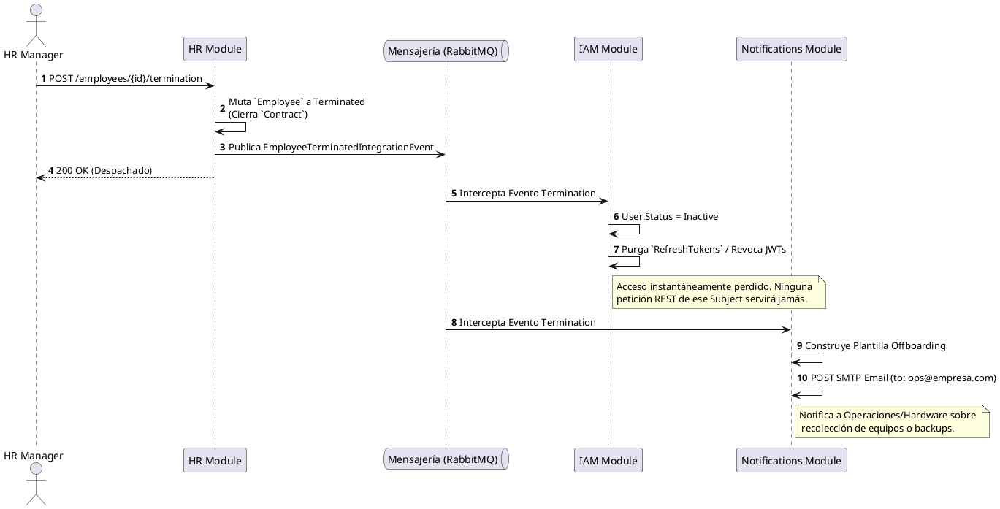

# Proceso Global 02: Employee Offboarding (Terminación)

## Objetivo

Documentar el flujo de revocación sistemática y cierre de relaciones laborales. Describe exactamente qué debe hacer el ERP core mediante coreografía de eventos cuando un gestor administrativo procede a "Dar de Baja" legal o voluntariamente a un empleado, garantizando ciberseguridad instantánea y coherencia en Recursos Humanos.

## Módulos participantes

- **Human Resources (HR):** Disparador de la orden de revocación laboral formal.
- **Identity & Access (IAM):** Encargado de paralizar, revocar y purgar accesos lógicos inmediatos.
- **Notifications:** Encargado de enviar posibles correos a TI / DevOps o al propio empleado cesado con detalles de nóminas finiquitadas.

## Flujo principal

### 1. Acto Administrativo Formal (Terminación)

- **Actor:** Gestor de Recursos Humanos.
- **Módulo:** `human-resources`
- **Caso de uso relacionado:** `UC-HR-03: Terminate Employment`

HR registra el cese oficial del empleado llenando los motivos (ej. Renuncia), y asignando la fecha límite. Al llegar esa hora (o instantáneamente), el agregado "Employee" muta a estado "Terminated". HR publica el `EmployeeTerminatedIntegrationEvent`.

### 2. Revocación Instantánea Paranoica

- **Actor:** Sistema asíncrono
- **Módulo:** `identity-and-access`

IAM intercepta a nivel inter-contexto el evento emitido por HR. Reconoce mediante el Identity Mapping (EmployeeId -> UserId) la cuenta subyacente.
Acciones: Inactiva o suspende permanentemente la cuenta en la Base de Datos, purga su caché y suscribe el ID a una "Blacklist de Revocación de Sesiones" para que los `Tokens JWT` ya emitidos mueran, matando en tiempo real cualquer acceso existente.

### 3. Comunicación a las partes

- **Actor:** Sistema
- **Módulo:** `notifications`

El módulo de notificaciones recibe `EmployeeTerminatedIntegrationEvent` desde el Bus local. Para este flujo, se configuran suscripciones que, en lugar de contactar al empleado, envían alertas a rutas internas (`SysAdmin` / `IT Support`) informando: "Revocación lógica efectuada; recuperar equipo físico."

> [!NOTE]
> Por simplicidad, actualmente se reutiliza el evento de terminación base. Se ha planificado extender esta capacidad con un evento dedicado (`EmployeeOffboardingAlertRequired`) en futuras fases para incluir payloads específicos de activos (Hardware, accesos VPN, etc.).

---

## Diagrama de Secuencia (Saga de Corte)

## Riesgos y Consideraciones

- Los motores de bases de datos no deben ser alterados nunca saltando las API formales (ej. un SysAdmin borrando al User a mano) porque violarían este engranaje de eventos dejando al Empleado vivo en HR pero muerto en IAM sin rastro en auditorías.
- Si el Message Broker (RabbitMQ) llegara a estar caído en el milisegundo exacto de la baja, la publicación del evento en HR **debe** persistirse vía **Outbox Pattern** de forma atómica en BD, así IAM lo tomará garantizado al reiniciar operaciones.

[back](../readme.md)
