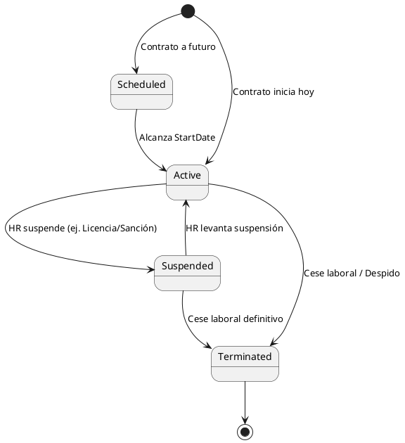
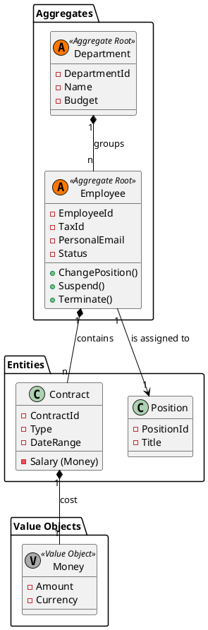

# Modelo de Dominio: Human Resources (HR)

**Bounded Context:** Gestion del talento humano y estructura organizacional  
**Responsabilidad Principal:** Administrar el ciclo de vida laboral del empleado, su relacion contractual y su ubicacion dentro de la organizacion  
**Version:** 1.0.0

## Lenguaje ubicuo

| Termino | Definicion | Ejemplo |
|---|---|---|
| Employee | Persona con relacion laboral formal con la empresa | empleado activo |
| Contract | Acuerdo laboral vigente o historico asociado al empleado que define su salario, puesto y duración | contrato indefinido |
| Department | Unidad organizacional con identidad propia que organizativa que agrupa a varios empleados y tiene un responsable (Manager) | departamento de ventas |
| Position | Cargo funcional dentro de la estructura | analista senior |
| Manager | Empleado responsable de otros empleados | responsable de area |

## Diseno tactico

### Aggregate roots

- **`Employee`**: aggregate root principal. Protege datos laborales, estado del empleado y consistencia del historial contractual.
  - *Ciclo de Vida (State Machine):*

- *Manejo de Concurrencia (Optimistic Locking):* Posee un atributo `Version` (entero o UUID temporal). Al intentar guardar cambios concurrentes, si la versión en la base de datos difiere de la cargada en memoria, se lanza una `OptimisticConcurrencyException` para prevenir superposición de contratos o estados inconsistentes.

- **`Department`**: aggregate root para representar una unidad organizacional con vida propia. Gestiona su propio ciclo de vida y presupuesto. Un departamento existe independientemente de si tiene empleados asignados o no en un momento dado.

### Entidades

- **`Contract`**: pertenece al agregado `Employee` y registra tipo, fechas y condiciones laborales.

  - Identificador: `ContractId`
  - Atributos: `Type` (Indefinido, Temporal), `StartDate`, `EndDate` (Opcional).
  - *Ciclo de vida:* Pertenece exclusivamente al agregado `Employee`.

- **`Position`**: representa el cargo funcional asignable dentro de la organizacion.
  - Identificador: `PositionId`
  - Atributos: `Title`, `Description`, `Level` (Opcional).
  - *Ciclo de vida:* Representa el cargo funcional dentro de la organización. Un `Employee` referencia un `Position` vigente a través de su asignación organizacional.

### Value objects

- **`Money`**: encapsula monto y moneda del salario.
- **`TaxId`**: identificador legal validado del empleado.
- **`DateRange`**: intervalo temporal valido para contratos u otras asignaciones.
- **`EmployeeId`**: identificador tecnico inmutable del empleado.
- **`PersonalEmail`**: correo utilizado para flujos de onboarding y comunicacion inicial.

### Domain services

- **`HiringService`**: coordina reglas que no pertenecen de forma natural a una sola entidad.

### Domain events

- `EmployeeHiredDomainEvent`
- `EmployeeSuspendedDomainEvent`
- `EmployeeTerminatedDomainEvent`

## Modelo Táctico (Diagrama de Clases)

## Reglas de negocio

1. No pueden existir dos empleados con el mismo `TaxId`.
2. Un empleado no puede tener contratos activos incompatibles al mismo tiempo.
3. Un empleado no puede ser su propio manager ni participar en ciclos jerarquicos.
4. El salario de un contrato debe respetar restricciones minimas aplicables.

## Notas de modelado

- `Human Resources` es la fuente de verdad del empleado como concepto laboral.
- El modulo no administra credenciales, sesiones ni permisos tecnicos; eso pertenece a IAM.
- Las integraciones hacia otros modulos deben salir mediante eventos de negocio, no mediante acceso directo a la persistencia.

[back](./readme.md)
