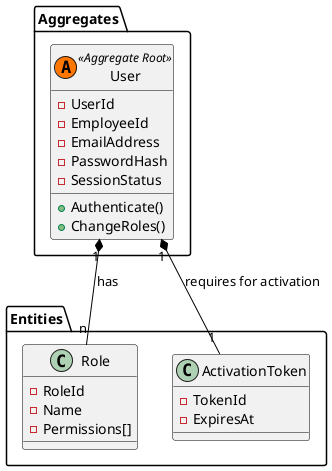

# Modelo de Dominio: Identity & Access (IAM)

**Bounded Context:** Gestión de Identidad y Acceso  
**Responsabilidad Principal:** Proteger el ecosistema del ERP, garantizando que solo los usuarios autenticados y autorizados puedan interactuar con los recursos del sistema.  
**Version:** 1.0.0

## Lenguaje ubicuo

| Termino | Definicion | Ejemplo |
|---------|------------|---------|
| User | Actor técnico con credenciales para acceder al ERP (No confundir con Empleado) | <info@herman.com> |
| Role | Agrupación lógica de permisos (RBAC) | HR_Manager, Admin |
| Permission | El derecho específico para ejecutar una acción (Grant/Claim) | users:create |
| Credentials | Datos (Email/Password) presentados para demostrar identidad | salt+hash |
| Token | Artefacto de seguridad (JWT) que representa una sesión activa | Bearer eyJhbGci... |
| Enrollment | Proceso de vinculación de un Empleado con una Identidad técnica | Event-driven provisioning |

## Diseno tactico

### Aggregate roots

- **`User`**: Entidad principal que centraliza la identidad técnica. Toda modificación sobre sus roles o credenciales debe pasar por esta raíz para garantizar consistencia.
  - **Atributos Clave:**
    - `UserId` (UUID): Identificador único interno en IAM.
    - `EmployeeId` (UUID): **[Identity Mapping]** Referencia inmutable al identificador del empleado en el contexto HR. Permite vincular la identidad técnica con la relación laboral sin acoplar los modelos.
    - **PasswordHash**: El dominio no conoce contraseñas en texto plano.
    - **Status (Enum):** * `Scheduled_For_Activation`: El usuario ha sido aprovisionado, pero su contrato aún no inicia
      - `Pending_Activation`: El contrato ya inició y se ha enviado el token, pero el usuario no ha establecido su contraseña.
      - `Active`: Usuario operando normalmente.
      - `Suspended`: Acceso revocado.

### Entidades

- **`Role`**: Entidad con identidad única (`Role_ID`). Agrupa un conjunto de permisos granulares.
- **`ActivationToken`**: Registro del token criptográfico generado para la cuenta, con su respectiva fecha de expiración.

### Value objects

- **`EmailAddress`**: Encapsula la validación sintáctica del correo. Único para cada usuario.
- **`PasswordHash`**: Representa la contraseña cifrada (Argon2id). El dominio nunca maneja texto plano.
- **`SessionStatus`**: Enum que define el ciclo de vida del usuario (`Scheduled_For_Activation`, `Pending_Activation`, `Active`, `Suspended`).
- **`AuthClaims`**: Estructura que define la carga útil del token (permissions, userId, email).

### Domain events

- `UserCreatedDomainEvent`: Emitido al aprovisionar la entidad.
- `UserActivationRequiredDomainEvent`: Emitido cuando el cron-job o el flujo base determinan que el usuario debe activarse.

## Reglas de negocio

1. Un `User` no puede existir sin un `EmailAddress` válido y único en el sistema.
2. Estado Inicial: Debe nacer en `Scheduled_For_Activation` si el contrato es futuro, o `Pending_Activation` si es inmediato.
3. Activación: Solo tras establecer una contraseña válida el usuario transiciona a estado `Active`.
4. Autorización: Se requiere al menos un `Role` asignado para que el sistema emita un `Token` funcional.
5. Idempotencia: El aprovisionamiento desde HR debe ignorar duplicados basados en `EmployeeId`.
6. Revocación de Acceso: El sistema debe suspender permanentemente la cuenta ante la recepción de un cese de relación laboral (`EmployeeTerminated`).
7. Sincronización Organizacional: Al detectar cambios en la estructura (`EmployeeOrganizationModified`), IAM debe evaluar si el cambio de departamento implica una reasignación automática de roles.

## Notas de modelado

- **Identity Mapping:** El modelo IAM guarda una referencia inmutable (`EmployeeId`) para vincularse con HR, pero no conoce los datos laborales del empleado.
- **Seguridad:** Las políticas de complejidad de contraseñas se validan en la capa de Aplicación/Dominio antes de generar el hash.

## Modelo Táctico (Diagrama de Clases)

[back](./readme.md)
