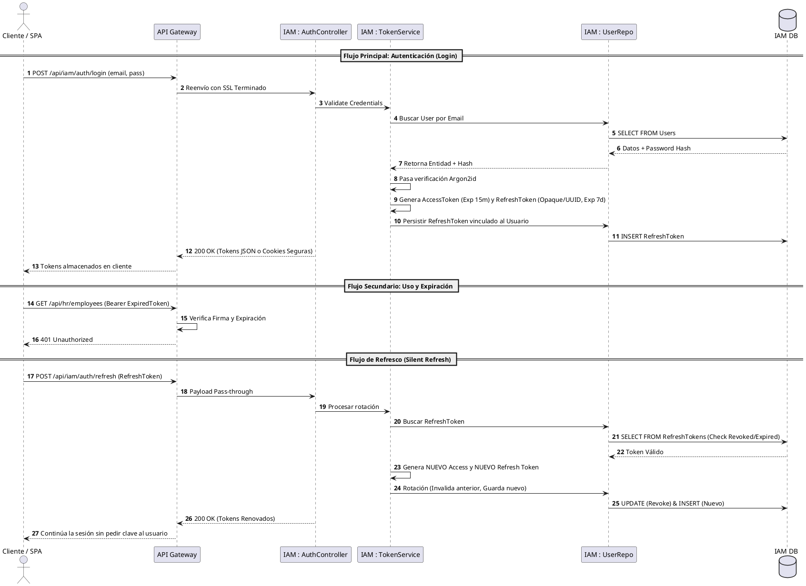

# Casos de Uso IAM - Sequence Diagram: Flujo de Autenticación

El siguiente diagrama detalla la dinámica operativa y de seguridad técnica dictada en la Arquitectura de Identidad.

## Diagrama: Login & Refresh Token Lifecycle

## Notas Técnicas

1. **Token Opaque vs JWT:** El Access Token es JWT (para que la Gateway y otros servicios validen independientemente), pero el Refresh Token debe ser opaco (o almacenado bajo hash en la base de datos) para permitir revocación inmediata ante amenazas.
2. **Rotación:** Se debe aplicar rotación de *Refresh Token*. Si un token refrescado previamente intenta ser re-usado, el sistema debe asumir un ataque de robo e invalidar TODA la cadena de tokens del usuario (según recomendaciones de seguridad OAuth 2.1).

[back](index.md)
