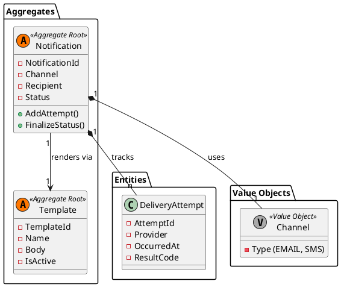

# Modelo de Dominio: Notifications

**Bounded Context:** Gestion de Comunicaciones Salientes  
**Responsabilidad Principal:** Enviar, gestionar y rastrear notificaciones de forma confiable y desacoplada.  
**Version:** 1.0.0

## Lenguaje ubicuo

| Termino | Definicion | Ejemplo |
|---|---|---|
| Notification | Unidad principal de comunicacion solicitada por el sistema | correo de activacion |
| Template | Definicion reutilizable del contenido de una notificacion | `user-activation-email` |
| DeliveryAttempt | Intento individual de envio a traves de un proveedor | segundo intento por timeout |
| Channel | Medio de entrega | EMAIL |
| Provider | Adaptador externo que ejecuta la entrega real | SendGrid |
| DeliveryStatus | Estado de procesamiento o entrega | Pending, Delivered, Retrying, Failed |

## Diseno tactico

### Aggregate roots

- **`Notification`**: aggregate root responsable del ciclo de vida de la notificacion, su estado y sus intentos de entrega.
- **`Template`**: aggregate root para administrar definiciones reutilizables de contenido y su activacion operativa.

### Entidades

- **`DeliveryAttempt`**: registra un intento concreto, su proveedor, fecha, resultado y error si aplica.

### Value objects

- **`Channel`**: canal de salida permitido por el sistema.
- **`Recipient`**: destino validado segun el canal.
- **`TemplateData`**: variables de entrada necesarias para renderizar contenido.
- **`ProviderResponse`**: encapsula resultado tecnico del proveedor.
- **`CorrelationId`**: referencia transversal al proceso de origen.

### Domain events

- `NotificationQueued`
- `NotificationSent`
- `NotificationRetryExhausted`
- `NotificationFailed`

## Reglas de negocio

1. **Plantilla Requerida:** Toda `Notification` debe estar asociada a un `Template` valido o a una definicion de contenido controlada.
2. **Idempotencia:** El mismo mensaje de origen no debe generar entregas duplicadas incompatibles.
3. **Reintentos y Circuit Breaker:** Una `Notification` solo puede pasar a `Sent` si al menos un `DeliveryAttempt` finalizo exitosamente.

    - Se realizarán máximo 3 reintentos automáticos (con *Exponential Backoff*) si el proveedor (SendGrid/SES) falla.
    - Se aplicará el patrón **Circuit Breaker** a nivel de Provider: si la tasa de fallos supera el umbral, el circuito se abre y las peticiones fallan rápido para evitar saturación de recursos.

4. Una `Notification` pasa a `Failed` solo despues de agotar politica de reintentos o detectar fallo no recuperable. El domain event `NotificationRetryExhausted` se emite antes de la transición definitiva a `Failed`.
5. **Auditoría:** El historico de intentos debe conservarse para soporte y auditoria.

## Notas de modelado

- `Notifications` no decide si una comunicacion debe existir; esa decision viene del modulo emisor o del evento consumido.
- El modulo abstrae proveedores externos para evitar contaminar el dominio de otros contextos.
- Las plantillas activas deben poder versionarse sin alterar notificaciones ya emitidas.

## Integracion con otros contextos

- **Consume:** `UserActivationRequiredIntegrationEvent` y otros eventos de negocio que deriven en comunicaciones.
- **Publica:** `EmailDeliveryFailedIntegrationEvent` cuando una entrega critica no puede completarse.

## Modelo Táctico (Diagrama de Clases)

[back](./readme.md)
